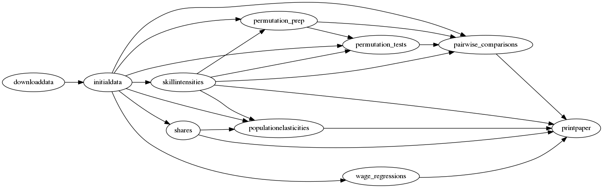

This repository contains the data and code underlying the paper "[The Comparative Advantage of Cities](http://faculty.chicagobooth.edu/jonathan.dingel/research/)" by Donald Davis and Jonathan Dingel.
This replication package was prepared by Jonathan Dingel, with assistance from Dylan Clarke, Luis Costa, Antonio Miscio, and Shirley Yarin.

## Code organization

Our project is organized as a series of tasks.
The main project directory contains 9 folders that represent 9 tasks.
Each task folder contains three folders: `input`, `code`, `output`.
A task's output is used as an input by one or more downstream tasks.
[This graph](task_flow.png) depicts the input-output relationships between tasks.

We use Unix's [`make`](https://www.gnu.org/software/make/manual/) utility to automate this workflow.
After downloading this replication package (and installing the relevant software), you can reproduce the figures and tables appearing in the published paper and the online appendix simply by typing `make` at the command line.

## Software requirements
The project's tasks are implemented via [Stata](http://www.stata.com) code and GNU/Linux shell scripts.
In particular, we used Stata 15 and GNU bash version 4.2.46(2).
The taskflow structure employs [symbolic links](https://en.wikipedia.org/wiki/Symbolic_link).

_Note to Mac OS X users_: 
The code presumes that Stata scripts can be run from Terminal via the command `stata-se`.
Please follow the instructions for [Running Stata from the Terminal](https://www.stata.com/support/faqs/mac/advanced-topics/#startup).

## Replication instructions

### Download and configure

1. Download (or clone) this repository by clicking the green `Clone or download` button above.
Uncompress the ZIP file into a working directory on your cluster or local machine.
2. Download the IPUMS micro data from [https://usa.ipums.org/usa/](usa.ipums.org). 
You will need to [register as an IPUMS-USA user](https://usa.ipums.org/usa/doc.shtml) 
in order to download the public-use micro data from the 1980 and 2000 Census of Population releases.
See details below.
3. (Optional) If you will be running your jobs using Slurm on a computing cluster, edit the file `commoncode/code/run.sbatch` to specify the `#SBATCH --partition=` name.

#### IPUMS download details

- The files `CAC_IPUMS_1980_Codebook.txt` and `CAC_IPUMS_2000_Codebook.txt` in `initialdata/input` contain lists of the variables to download.
- Do not extract any extra variables beyond the ones listed. The scripts `CAC_PREP_IPUMS_1980.do` and `CAC_PREP_IPUMS_2000.do` within `initialdata/code` make assumptions about the contents of these files.
- Rename the `.dat` files that you download from IPUMS as `IPUMS_1980.dat` and `IPUMS_2000.dat` and place them in the `initialdata/input` folder.

### Run code

Typing `make` in the working directory at the Linux/MacOSX command line will execute all the project code.

### Notes on running code
- It is best to replicate the project using the `make` approach described above.
Nonetheless, it is also possible to produce the results task-by-task in the order depicted in the [flow chart](task_flow.png).
If all upstream tasks have been completed, you can complete a task by navigating to the task's `code` directory and typing `make`.
- The `downloaddata` and `install_packages` tasks require an internet connection.
- The task `permutation_tests` is pretty slow. It involves 30 (parallel) jobs that take about 12 hours each.
